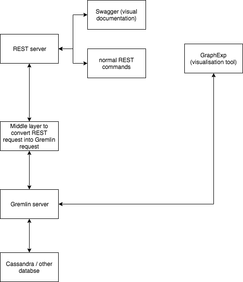

# PoC relationship management service

## Goal
The basic motivation is to get a fullstack (REST API / storage / visualisation) tool that can
- Get and store elements, they may have a relationship between them
- Get information concerning those elements
- Display them in a nice UI

One use case could be
1/ our customer sends a new message
2/ we store this message and link it to the previous message emitted by this customer
3/ the customer can visualise it and see how it is integrated with the previous messages

## Architecture



### Swagger
Swagger allows the API to be nicely displayed, facilitate testing as well.

### REST server
A scalatra server that receives REST commands and acts accordingly

### Middle layer
Convert the "get" and other REST command into gremlin request and vice versa

### Gremlin server
The last layer between the messages and the rest, allows to look up in the graph and create elements, as well as relationship between the elements

### Cassandra / elasticsearch
Where the data is stored. elasticsearch provide Gremlin with more power, not necessary, need to investigate if really needed (cf https://docs.janusgraph.org/0.2.0/search-predicates.html)

### GraphExp
A nice visualisation tool

### Set up
* clone this repository
* launch the various docker images (elasticsearch, cassandra, swagger-ui)
```
$ docker run --name es -d -p 9200:9200 -p 9300:9300 elasticsearch:5.6
$ docker run --name jg-cassandra -d -e CASSANDRA_START_RPC=true -p 9160:9160 -p 9042:9042 -p 7199:7199 -p 7001:7001 -p 7000:7000 cassandra:3.11
```
Sometimes, elasticsearch can crash on launch, this problem can be solved by increasing the amount of RAM allocated to docker (2.5GB is good enough)
* launch the gremlin server :
```
$ cd janusgraph-0.3.1
$ bin/gremlin-server.sh conf/gremlin-server/gremlin-server.yaml
```
the gremlin server will not launch if cassandra or elasticsearch are not configured properly
* As this is still super alfa not optimized stuff, a "random" graph has to be created, then deleted. For this, just launch a gremlin instance, connect to the gremlin server, get the graph up and running, then delete it (Protip: it also teaches you how to delete a graph, which can come in handy ;-) )
```
$ cd janusgraph-0.3.1
$ bin/gremlin.sh
> :remote connect tinkerpop.server conf/remote.yaml
> :remote console
> graph=graph.io(graphml()).readGraph('tmp/air-routes.graphml') (can take quite long to load)
> g = graph.traversal()
> g.V().drop()
```
This mess is only needed once, as long as you don't rm the cassandra docker image, you're good to go

* let's launch the scalatra server
```
$ cd scalatra-server
$ sbt
> jetty:start
```
now, we can start the swagger-ui docker image
```
$ docker run -p 80:8080 -e API_URL=http://0.0.0.0:8080/api-docs/swagger.json swaggerapi/swagger-ui
```
* **populate the graph** launching the main of tests.java.com.ubirch.swagger.example.AddVertexTests.java in the scalatra project
* **Visualise the data** launch a web server of the graphexp folder (I use the plugin webserver for chrome), you should be welcome by a nice graph


## Functionalities
For the moment, some pieces here and there are working, that I am constantly breaking and fixing. As you'll notice, it is a multicultural project (mostly some java and scala), but soon the java will be removed.

### Adding vertices

It is possible, through the REST API, to add some vertices, different use case exist:

* Two new vertices (not already present in the database): both are created and are linked with an edge.
* One already exist, one is new: the new one is created, and both are linked
* The two vertices already exist: if they're not linked, an edge will be created between them, if not, nothing appens.

A newly created vertex can contain the following item:

* **mandatory** an ID (int)
* a list<String, String> of properties (ex: *name:aName*)

An edge between two vertices can contain a list<String, String> of properties

### Accessing vertices

It is possible to get all the informations about a vertex if its ID is provided. A JSON file is returned containing its element (ID, properties, ...).

An optional depth can be given. In this case, its neighbours ID(other vertices linked at a given distance) will be returned.

### Graph visualisation

GraphExp provide a way to display the graph stored in the database.


## TODO

Lots of things!

* Translate the middle layer to scala
* Add unit testing
* Evaluate if ElasticSearch is really needed
* Clean up the code and refactor it
* Fix Jetty error
* Modify GraphExp so that the graph can not be modified through it, just accessed.
* Make it easily deployable